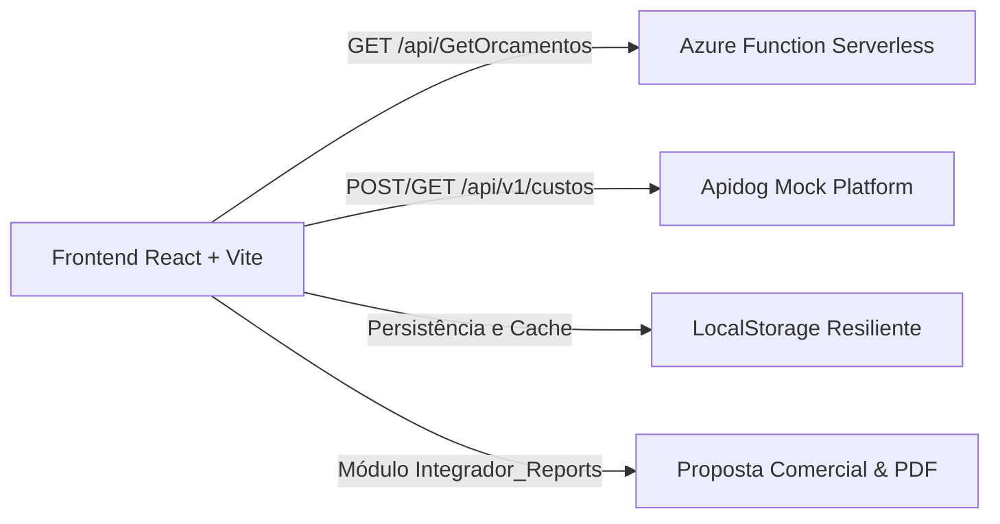

# ⚙️ Integrador de Orçamentos — Cliente Schulz S/A (SKA Automação)

> **Projeto Acadêmico PJBL**  
> Aplicação Web Frontend desenvolvida em **React** integrada a serviços Serverless **Azure Functions (GET Mock)** e plataforma **Apidog Mock**.

---

## 🔗 Links de Acesso & Publicação

* **🌐 Site em Produção (GitHub Pages):**  
  `https://[SEU-USUARIO-GITHUB].github.io/[NOME-DO-REPOSITORIO]/`  
  *(Exemplo: `https://matheusfacul.github.io/integrador-orcamentos-schulz/`)*

* **☁️ Site em Produção (Azure Static Web Apps):**  
  `https://gray-cliff-0938b810f.azurestaticapps.net/` *(ou link de deploy no Azure)*

* **💻 Repositório Público no GitHub:**  
  `https://github.com/[SEU-USUARIO-GITHUB]/[NOME-DO-REPOSITORIO]`

* **⚡ Endpoint GET Azure Functions:**  
  `https://func-integrador-schulz.azurewebsites.net/api/GetOrcamentos`

* **🐶 Endpoints de Mock no Apidog:**  
  * **Cálculo de Custos:** `https://mock.apidog.com/m1/498210-492100-default/api/v1/orcamentos/{id}/custos`  
  * **Relatório Formal:** `https://mock.apidog.com/m1/498210-492100-default/api/v1/relatorios/integrador-reports`

---

## 📖 1. Visão Geral do Sistema

O **Integrador de Orçamentos** é um sistema projetado pela **SKA Automação de Engenharias Ltda** para o cliente **Schulz S/A**, focado na orçamentação técnica e comercial de peças usinadas (como virabrequins para compressores, pinças de freio automotivas, carcaças de compressores rotativos e pistões de alta pressão).

A aplicação web centraliza dados de peças, processos de fabricação CNC, centros de custo, desenhos técnicos dimensionais e geração de propostas formais.



---

## 🖥️ 2. Telas e Funcionalidades Implementadas (PJBL)

A aplicação contempla **mais de 5 telas e fluxos interativos**, superando amplamente o requisito mínimo de 2 telas:

### 📊 Tela 1: Dashboard & Consulta de Orçamentos (RF02)
* **Consumo de API:** Comunicação direta com o endpoint **GET da Azure Function** (`/api/GetOrcamentos`).
* **KPIs Executivos:** Total orçado em R$, quantidade de peças ativas, total de operações CNC mapeadas e taxa de aprovação comercial.
* **Filtros Dinâmicos:** Pesquisa instantânea por código da peça, descrição, cliente e status (*Pendente, Em Análise, Aprovado*).
* **Banner de Status da API:** Indicador visual de latência em milissegundos, código HTTP 200 OK e botão de sincronização manual.

### 📐 Tela 2: Detalhes do Orçamento & Motor de Cálculo de Custos (RF03, RF06)
* **Parâmetros Gerais:** Edição de lotes de fabricação, matéria-prima, centros de custo (*CC-310, CC-220, CC-340, CC-210*), margem de lucro e alíquotas tributárias.
* **Folha de Operações CNC:** Tabela de operações de torneamento, fresamento 5 eixos, retífica cilíndrica e tratamentos térmicos com tempos de setup e ciclo.
* **⭐ Destaque do Projeto (RF03): Flag "Zerar Custo":**  
  Permite ao orçamentista marcar operações específicas para terem seu custo zerado (ex: operações bonificadas, retrabalho interno ou inspeção de garantia), recalculando o orçamento instantaneamente em tempo real.
* **Adição e Remoção:** Possibilidade de adicionar novas operações de usinagem dinamicamente.

### 🔍 Tela 3: Visualizador de Desenhos Técnicos 2D/SVG (RF04)
* Visualização interativa de cotas dimensionais, especificações de tolerância (*ISO 2768-mK*), rugosidade superficial (*Ra*) e certificação de qualidade.

### 📑 Tela 4: Módulo de Relatórios — Integrador_Reports (RF05, RF10)
* Emissão da proposta comercial formalizada com cabeçalho oficial da Schulz S/A e SKA.
* Demonstrativo analítico de composição de tempos de máquina, mão de obra, matéria-prima, margem de lucro e preço do lote.
* Botão para **impressão/geração de PDF** e **exportação dos dados em formato JSON** para integração com outros sistemas (RF10).

### 📥 Tela 5: Importador de Planilhas & Validação de Integridade (RF01, RF07)
* Simulação de importação de planilhas de orçamentos Schulz com motor de validação de consistência antes da gravação na base.

### 🕒 Tela 6: Trilha de Auditoria (RF09)
* Histórico rastreável de todas as modificações, flags acionadas e recálculos realizados.

---

## 🛠️ 3. Tecnologias Utilizadas

* **Linguagem & Framework:** JavaScript (ES6+), React 18
* **Build Tool:** Vite 6 (configurado com `base: './'` para compatibilidade universal)
* **Estilização:** Tailwind CSS 3 com paleta industrial customizada Schulz & SKA
* **Ícones:** Lucide React
* **Backend Mock:** Azure Functions Serverless HTTP GET & Apidog Mock Platform
* **Deploy:** GitHub Pages (com GitHub Actions CI/CD automatizado) e Azure Static Web Apps

---

## 🚀 4. Como Executar o Projeto Localmente

### Pré-requisitos
* **Node.js** (versão 18 ou superior) e **npm** instalados.

### Passo a passo
1. **Clone o repositório:**
   ```bash
   git clone https://github.com/[SEU-USUARIO-GITHUB]/[NOME-DO-REPOSITORIO].git
   cd [NOME-DO-REPOSITORIO]
   ```

2. **Instale as dependências:**
   ```bash
   npm install
   ```

3. **Inicie o servidor de desenvolvimento:**
   ```bash
   npm run dev
   ```
   Acesse a aplicação no navegador em: `http://localhost:3000` (ou porta indicada no terminal).

4. **Gerar a versão de produção (Build):**
   ```bash
   npm run build
   ```
   Os arquivos finais otimizados serão gerados na pasta `/dist`.

---

## 🌐 5. Como Publicar no GitHub Pages

O projeto já inclui o arquivo de workflow automatizado em `.github/workflows/deploy.yml`.

Para ativar a publicação automática:
1. Suba o código para o seu repositório no GitHub:
   ```bash
   git add .
   git commit -m "feat: frontend integrador de orcamentos schulz pjbl"
   git push origin main
   ```
2. No GitHub, acesse seu repositório e vá em:  
   **Settings** > **Pages**
3. Na seção **Build and deployment** > **Source**, selecione:  
   👉 **GitHub Actions**
4. Aguarde cerca de 1 minuto até a pipeline ser concluída e o link público do seu site estará disponível!

---

## 📄 6. Estrutura de Arquivos do Projeto

```text
├── .github/
│   └── workflows/
│       └── deploy.yml          # Pipeline CI/CD para GitHub Pages
├── public/                     # Arquivos estáticos
├── src/
│   ├── components/
│   │   ├── ApiStatusBanner.jsx # Banner de monitoramento do GET Azure Functions
│   │   ├── AuditHistoryModal.jsx # Histórico e auditoria (RF09)
│   │   ├── Dashboard.jsx       # Consulta e listagem com filtros (RF02)
│   │   ├── ImportModal.jsx     # Importação e validação de dados (RF01, RF07)
│   │   ├── IntegradorReports.jsx # Módulo Integrador_Reports (RF05, RF10)
│   │   ├── Navbar.jsx          # Cabeçalho corporativo Schulz + SKA
│   │   ├── OrcamentoDetail.jsx # Cálculo de custos e flag zerar custo (RF03, RF06)
│   │   ├── TechnicalDrawingModal.jsx # Visualizador de desenhos técnicos (RF04)
│   │   └── Toast.jsx           # Notificações visuais
│   ├── data/
│   │   └── mockData.js         # Base de dados de peças e operações industriais
│   ├── services/
│   │   └── api.js              # Serviço de integração Azure Functions & Apidog
│   ├── App.jsx                 # Componente principal e controle de estado
│   ├── index.css               # Estilizações globais e Tailwind
│   └── main.jsx                # Ponto de entrada React
├── GRUPO.md                    # Identificação da equipe PJBL
├── Prompt.md                   # Prompt de IAG utilizado na concepção
├── README.md                   # Documentação completa do projeto
├── index.html                  # HTML base
├── package.json                # Dependências e scripts
├── tailwind.config.js          # Configuração de temas e cores
└── vite.config.js              # Configuração Vite com base relativa
```

---

## 📝 Documentos Entregues
* [GRUPO.md](file:///home/matheusfacul/Documents/Faculdade/Clude/GRUPO.md)
* [Prompt.md](file:///home/matheusfacul/Documents/Faculdade/Clude/Prompt.md)
* [README.md](file:///home/matheusfacul/Documents/Faculdade/Clude/README.md)
