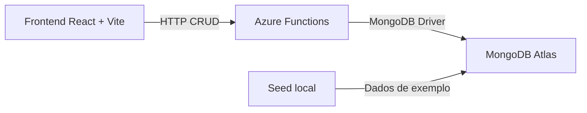

# Integrador de Orçamentos — Schulz S/A / SKA Automação

> Projeto acadêmico PJBL composto por um frontend React e uma API serverless em Azure Functions, com persistência no MongoDB Atlas.

## Arquitetura



O frontend não acessa o MongoDB diretamente. Ele chama as Azure Functions `GetOrcamentos`, `CreateOrcamento`, `UpdateOrcamento` e `DeleteOrcamento`; as Functions fazem a persistência na coleção de orçamentos do Atlas.

## Estrutura do repositório

```text
Projeto_Claud/
├── Projeto/                       # Frontend React/Vite
│   ├── src/components/            # Interface e fluxos da aplicação
│   ├── src/services/api.js        # Cliente HTTP do CRUD Azure Functions
│   ├── src/data/                  # Dados auxiliares locais
│   └── scripts/seedMongoAtlas.mjs # Seed do MongoDB Atlas
├── functions/                     # Aplicação Azure Functions (Node.js v4)
│   ├── src/
│   │   ├── index.js                # Bootstrap e registro explícito das Functions
│   │   ├── shared/                 # Infraestrutura MongoDB e respostas HTTP
│   │   └── features/orcamentos/    # Vertical slices: create, list, update e delete
│   ├── host.json
│   ├── local.settings.example.json
│   └── package.json
├── .github/workflows/deploy.yml   # Deploy apenas do frontend no GitHub Pages
├── GRUPO.md
└── PROMPT.md
```

## Tecnologias

- **Frontend:** React 18, Vite 6, Tailwind CSS e Lucide React.
- **Backend:** Azure Functions Node.js v4 e driver oficial do MongoDB.
- **Banco de dados:** MongoDB Atlas.
- **Publicação do frontend:** GitHub Pages via GitHub Actions.

## Executar localmente

### 1. Frontend

```bash
cd Projeto
npm ci
npm run dev
```

O frontend usa, por padrão, a URL de produção declarada em `Projeto/src/services/api.js`. Para apontá-lo a outro ambiente, defina `VITE_AZURE_FUNCTIONS_BASE_URL` em `Projeto/.env` com o sufixo `/api`.

### 2. Azure Functions

Pré-requisitos: Node.js e Azure Functions Core Tools v4.

```bash
cd functions
npm ci
cp local.settings.example.json local.settings.json
```

Edite `functions/local.settings.json` e informe pelo menos a variável `MONGO_URI`. Em seguida, inicie a API:

```bash
npm start
```

Por padrão, as Functions locais são expostas em `http://localhost:7071/api`. Para conectar o frontend local a elas, adicione esta linha a `Projeto/.env`:

```dotenv
VITE_AZURE_FUNCTIONS_BASE_URL=http://localhost:7071/api
```

### 3. Popular o MongoDB Atlas com os dados de exemplo

O seed utiliza `functions/package.json` para carregar o driver MongoDB e lê os orçamentos de `Projeto/mock-bd.js`.

```bash
cd Projeto
npm run seed:mongo
```

Configure `MONGO_URI` (ou `MONGODB_URI`) em `Projeto/.env` antes de rodar o comando. As credenciais não devem ser versionadas.

## Deploy

O workflow `.github/workflows/deploy.yml` permanece responsável somente pelo build e deploy do frontend `Projeto/` no GitHub Pages. O deploy das Azure Functions deve ser configurado separadamente com as credenciais da Azure Function App, pois elas não estão presentes neste repositório.

## Segurança de configurações

- `functions/local.settings.json` fica ignorado pelo Git; use `functions/local.settings.example.json` como modelo.
- `Projeto/.env` também fica ignorado pelo Git.
- Nunca inclua URI, usuário, senha ou chave de Function nos arquivos versionados.

## Documentos entregues

- [GRUPO.md](GRUPO.md)
- [PROMPT.md](PROMPT.md)
