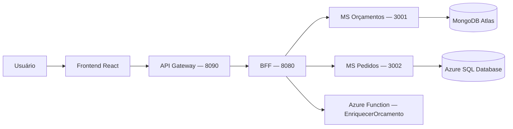

# Integrador de Orçamentos — Schulz S/A / SKA Automação

Aplicação acadêmica com dois CRUDs, persistência em nuvem, API Gateway,
BFF agregador e uma Azure Function de cálculo.

**Site:** https://schulz-gateway.victoriousdesert-17c3e7d9.canadacentral.azurecontainerapps.io

Entre com as credenciais de `services/api-gateway/.env`. Frontend e gateway
estão na mesma origem HTTPS. BFF e microserviços executam em contêineres
na Azure, com entrada interna; suas APIs e Swagger passam pelo gateway.

## Arquitetura


```mermaid
flowchart LR
    U[Usuário] --> F[Frontend React]
    F --> G[API Gateway — 8090]
    G --> B[BFF — 8080]
    B --> M[MS Orçamentos — 3001]
    B --> S[MS Pedidos — 3002]
    M --> A[(MongoDB Atlas)]
    S --> Q[(Azure SQL Database)]
    B --> C[Azure Function — EnriquecerOrcamento]
```

O frontend chama somente `/api` no gateway. O gateway autentica a sessão,
limita requisições e encaminha as chamadas ao BFF. O BFF consulta os dois
microserviços e, em `/api/aggregated-data`, envia os dados à Azure Function.
A resposta agrega orçamentos, pedidos e cálculo em um único JSON.

| Componente | Responsabilidade |
|---|---|
| API Gateway Express | Login, sessão, limite de requisições, roteamento e entrada central |
| BFF Express | Composição das respostas e encaminhamento dos dois CRUDs |
| Microserviço Mongo | CRUD de orçamentos em `schulz.orcamentos`, no Atlas |
| Microserviço SQL | CRUD de pedidos em `dbo.TB_PEDIDOS`, no Azure SQL |
| Azure Function HTTP | Cálculo de custos, impostos, preço do lote e enriquecimento |

A Function publica `POST /api/EnriquecerOrcamento` e exige uma chave armazenada
somente no BFF. O CRUD Mongo é executado pelo microserviço Mongo. Falhas dos
bancos são exibidas como erros, sem gravação alternativa no navegador ou JSON.
A agregação informa `status: partial` quando um serviço falha.

O gateway é um serviço Express separado do BFF. Não requer uma conta AWS.
As chamadas diretas ao BFF e aos microserviços exigem um token interno que o
frontend não recebe. No Docker Compose, apenas a porta do gateway é publicada.

## Executar neste ambiente

Pré-requisito: **Node.js 22** (`.nvmrc`). Os arquivos locais de configuração já
estão preparados neste computador. Instale as dependências, caso necessário:

```bash
npm ci
npm ci --prefix functions
npm ci --prefix Projeto
npm ci --prefix services/api-gateway
npm ci --prefix services/bff
npm ci --prefix services/ms-orcamentos-mongo
npm ci --prefix services/ms-pedidos-sql
```

Neste computador, o Node.js 22 está disponível no diretório de ferramentas
local. Se o terminal ainda usar Node.js 18, configure o PATH para esta sessão:

```bash
export PATH="$HOME/.local/share/projeto-claud-tools/node_modules/.bin:$PATH"
```

Na raiz do repositório:

```bash
npm run dev
```

O comando inicia frontend, gateway, BFF e os dois microserviços. A Azure Function
já está publicada na nuvem. Use `Ctrl+C` para encerrar os processos locais.

Acesse **http://localhost:3000**. O usuário e a senha estão em
`services/api-gateway/.env`, nas variáveis `GATEWAY_USERNAME` e
`GATEWAY_PASSWORD`. O login cria um cookie HttpOnly/SameSite Strict. As sessões
são mantidas em memória para a execução acadêmica; reiniciar o gateway encerra
as sessões. Use o mesmo hostname ao navegar entre aplicação e Swagger.

O Vite encaminha `/api` ao gateway em `http://127.0.0.1:8090`. Depois do build,
o gateway também serve o frontend compilado em **http://localhost:8090**.
As duas formas de acesso usam a mesma entrada de API.

## Configurar outro ambiente

Copie os arquivos `.env.example` dos serviços para `.env` e preencha:

| Arquivo | Variáveis |
|---|---|
| `services/api-gateway/.env` | `BFF_URL`, `GATEWAY_USERNAME`, `GATEWAY_PASSWORD`, `INTERNAL_API_TOKEN` |
| `services/bff/.env` | `MS_MONGO_URL`, `MS_SQL_URL`, `AZURE_FUNCTION_URL`, `AZURE_FUNCTION_KEY`, `INTERNAL_API_TOKEN` |
| `services/ms-orcamentos-mongo/.env` | `MONGO_URI`, banco/coleção e `INTERNAL_API_TOKEN` |
| `services/ms-pedidos-sql/.env` | `SQL_SERVER`, `SQL_DATABASE`, `SQL_USER`, `SQL_PASSWORD`, `INTERNAL_API_TOKEN` |

Use o mesmo token interno aleatório nos quatro serviços. As credenciais de
banco e a chave da Function pertencem aos backends. O frontend usa apenas
`VITE_API_BASE_URL=/api`; não coloque segredos em variáveis `VITE_*`.

Para HTTPS, configure `GATEWAY_COOKIE_SECURE=true` e os domínios permitidos em
`ALLOWED_ORIGINS`. O ambiente local usa HTTP e cookie sem a flag Secure.

A configuração inicial da tabela e a importação dos pedidos locais estão em
[services/ms-pedidos-sql/README.md](services/ms-pedidos-sql/README.md).

## APIs e Swagger

Depois de entrar na aplicação, abra:

| Serviço | Swagger pelo gateway |
|---|---|
| Orçamentos | http://localhost:3000/api/docs/mongo/ |
| Pedidos | http://localhost:3000/api/docs/sql/ |
| BFF | http://localhost:3000/api/docs/bff/ |

Em execução pelo frontend compilado/Docker, use a porta **8090** nos mesmos
caminhos. As documentações usam a sessão autenticada da aplicação.

| Método | Endpoint público | Operação |
|---|---|---|
| POST / GET / DELETE | `/api/session` | Entrar, consultar sessão, sair |
| GET / POST | `/api/orcamentos` | Listar/criar orçamento |
| GET / PUT / DELETE | `/api/orcamentos/:id` | Consultar/editar/excluir orçamento |
| GET / POST | `/api/pedidos` | Listar/criar pedido |
| GET / PUT / DELETE | `/api/pedidos/:id` | Consultar/editar/excluir pedido |
| GET | `/api/aggregated-data` ou `/aggregated-data` | JSON consolidado dos três componentes |

A tela **Visão BFF** mostra os estados reais dos serviços e o JSON recebido.
O cálculo respeita o lote, a flag de custo zerado, a margem e os impostos.

## Recursos Azure

| Recurso | Configuração |
|---|---|
| Function App | `cloud-projeto-orc-f-app` — Node.js 22 / Azure Functions v4 |
| Endpoint | `https://cloud-projeto-orc-f-app.azurewebsites.net/api/EnriquecerOrcamento` |
| SQL Server | `sql-schulz-alex-b6fa36.database.windows.net` |
| Banco SQL | `schulz-pedidos` |
| Grupo / região | `cloudprojetoorcfapp` / Canadá Central |
| SQL gratuito | General Purpose Serverless, `useFreeLimit=true`, `AutoPause` ao atingir a cota |

O SQL também pausa após 60 minutos sem atividade. O acesso SQL do computador
está limitado pela regra de firewall `ProjetoClaudLocal`. Os contêineres usam
regras `SchulzContainerApps-*` para seus IPs de saída. Se o IP público mudar,
atualize a regra correspondente. A primeira conexão após uma pausa pode exigir nova tentativa.

A opção “1 DTU” não está disponível na assinatura/região consultada. O projeto
mantém a oferta gratuita serverless, conforme a escolha feita para este ambiente.
Não há conversão para um plano DTU pago.

## Docker

As quatro imagens públicas usam a tag `v3.0.0`:

| Imagem | Docker Hub |
|---|---|
| Gateway e frontend | [schulz-gateway](https://hub.docker.com/r/nj9ouidvb2v3cno4/schulz-gateway) |
| BFF | [schulz-bff](https://hub.docker.com/r/nj9ouidvb2v3cno4/schulz-bff) |
| CRUD Mongo | [schulz-ms-mongo](https://hub.docker.com/r/nj9ouidvb2v3cno4/schulz-ms-mongo) |
| CRUD SQL | [schulz-ms-sql](https://hub.docker.com/r/nj9ouidvb2v3cno4/schulz-ms-sql) |

Com os quatro `.env` preenchidos, para usar imagens publicadas:

```bash
docker compose -f docker-compose.yml -f docker-compose.images.yml pull
npm run docker:up
```

Acesse http://localhost:8090. Somente essa porta é publicada. Para compilar o
código local, use `docker compose up --build`. Para outra porta, defina
`GATEWAY_PORT`; para outra versão, `IMAGE_TAG`. O login aceita por padrão a
origem local na porta 8090; acrescente outras origens a `ALLOWED_ORIGINS` se necessário.

Build e publicação reproduzíveis (Docker autenticado e Node.js 22):

```bash
IMAGE_TAG=v3.0.1 npm run docker:build
IMAGE_TAG=v3.0.1 npm run docker:push
```

Os contêineres usam Node.js 22 e usuário sem privilégios. Os arquivos de
credenciais não entram nas imagens; são passados em tempo de execução.

## Camadas e casos de uso

Nos microserviços, `domain/` contém validações e erros; `application/ports/`
define o contrato do repositório. Cada operação fica em uma fatia
`features/<domínio>/<operação>/*.use-case.js`, com repositório injetado.
`application/*-use-cases.js` reúne os casos; `composition/` conecta os drivers;
`presentation/` adapta HTTP e códigos de resposta. `infrastructure/` contém
somente persistência e clientes externos.

No BFF, as fatias de agregação e geração de pedido recebem gateways por
injeção. No API Gateway, entrar, consultar sessão e sair são casos separados;
criptografia, armazenamento e proxy HTTP ficam na infraestrutura. Na Function,
a fatia de enriquecimento contém domínio, aplicação e apresentação HTTP.

As dependências apontam para as regras de negócio. Somente a composição
conhece os adaptadores concretos. Os serviços se comunicam por HTTP, sem
importar código de outros backends.

## Testes

```bash
npm test
# Com todos os serviços locais em execução:
npm run test:integration
# Para testar a URL pública, usando os mesmos .env locais:
GATEWAY_URL=https://schulz-gateway.victoriousdesert-17c3e7d9.canadacentral.azurecontainerapps.io npm run test:integration
# Fluxo real no Chrome headless (requer google-chrome instalado):
GATEWAY_URL=https://schulz-gateway.victoriousdesert-17c3e7d9.canadacentral.azurecontainerapps.io node scripts/smoke-ui.mjs
```

A suíte possui **26 testes**: 23 de comportamento e 3 de arquitetura.
`npm run test:architecture` analisa o grafo real com dependency-cruiser,
verifica a ausência de I/O e configuração nos casos de uso, e comprova que uma
importação proibida introduzida em uma fixture é rejeitada. As regras estão em
`.dependency-cruiser.cjs`; incluem domínio independente, aplicação sem drivers,
isolamento entre serviços, ausência de ciclos e frontend sem drivers de banco.

A integração testa os dois CRUDs pelo gateway, confirma alterações diretamente
nos bancos e verifica o cálculo da Function. Remove seus próprios registros
temporários e preserva os anteriores. Requer acesso do computador aos bancos.
O teste de navegador verifica login HttpOnly, CRUD SQL, persistência após
recarregar e os três nós online, salvando uma captura em `dist/`.

## Publicação

A infraestrutura está em [infrastructure/main.bicep](infrastructure/main.bicep).
O script lê os `.env` existentes, envia os segredos como parâmetros seguros
usando arquivo temporário com acesso restrito e configura o firewall SQL para
os IPs de saída dos contêineres. Não usa as credenciais administrativas do banco.

```bash
az login
# As imagens da tag devem existir no Docker Hub antes do deploy.
IMAGE_TAG=v3.0.0 npm run deploy:azure
```

O script requer Python 3, Azure CLI, Node.js e as dependências do gateway.
`AZURE_CLI` permite indicar outro caminho do executável. Para outra assinatura,
use `az account set`. Os parâmetros opcionais `AZURE_RESOURCE_GROUP`,
`AZURE_LOCATION`, `AZURE_ENVIRONMENT` e `DOCKERHUB_NAMESPACE` ajustam o destino;
o grupo de recursos deve existir. Atlas e SQL precisam permitir a rede de saída.

O Container Apps usa perfil Consumption, 0,25 CPU/0,5 GiB por serviço e escala
0–1. Há consumo de créditos além da franquia; não há garantia de custo zero.
O primeiro acesso após inatividade pode demorar. As sessões são locais ao
processo: escala até zero, reinício ou nova versão exigem novo login.

O workflow `ci.yml` testa o código e constrói as quatro imagens em PRs e pushes.
`publish-images.yml` permite publicar uma nova tag manualmente no Actions;
para isso, configure `DOCKERHUB_TOKEN` como secret com um token de escrita da
conta Docker Hub. A publicação inicial `v3.0.0` foi feita pelo Docker CLI.
Atualizar as imagens não altera a Azure automaticamente: execute o deploy com
a mesma `IMAGE_TAG`. Não publique código novo reutilizando uma tag existente.

O workflow `deploy.yml` mantém o endereço do GitHub Pages como redirecionamento
para a aplicação completa. A variável de repositório `PUBLIC_APP_URL` controla
o destino. Essa mudança entra em vigor após merge na branch principal e a
execução do workflow; o endereço direto da Azure já independe do Pages.

A Function é publicada separadamente, com build remoto:

```bash
python3 scripts/package-function.py
az functionapp deployment source config-zip -g cloudprojetoorcfapp -n cloud-projeto-orc-f-app --src dist/functions.zip --build-remote true
```

O pacote contém apenas `host.json`, `package.json`, `package-lock.json` e `src/`.
Nunca inclua `local.settings.json` ou `.env`. A chave da Function fica no BFF.

## Documentos do projeto

- [GRUPO.md](GRUPO.md)
- [PROMPT.md](PROMPT.md)
- [Contexto PJBL](contexto/CONTEXTO_PROJETO_PJBL.md)
- [Checklist PJBL](contexto/CHECKLIST_ENTREGA_PJBL.md)
- [Gateway](services/api-gateway/README.md)
- [BFF](services/bff/README.md)
- [Microserviço Mongo](services/ms-orcamentos-mongo/README.md)
- [Microserviço SQL](services/ms-pedidos-sql/README.md)

Referências: [padrão BFF](https://learn.microsoft.com/en-us/azure/architecture/patterns/backends-for-frontends),
[segurança Express](https://expressjs.com/en/advanced/best-practice-security/) e
[oferta gratuita Azure SQL](https://learn.microsoft.com/en-us/azure/azure-sql/database/free-tier).
